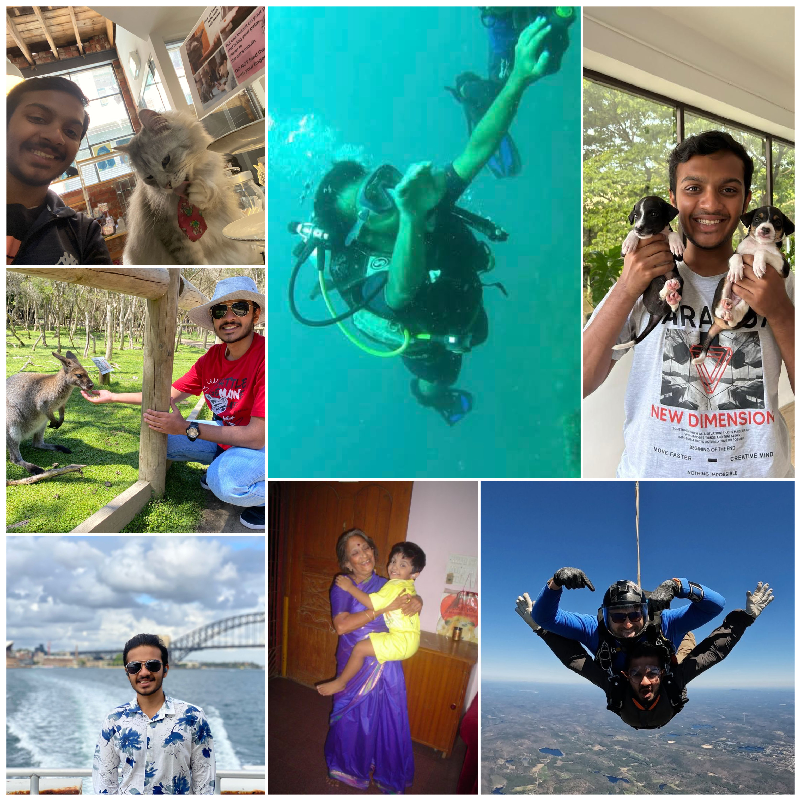

  

  Hello! I'm Anirudh from the lively city of <a href="https://en.wikipedia.org/wiki/Chennai" target="_blank">Chennai</a>, India. In my free time, I love listening to <a href="https://en.wikipedia.org/wiki/Carnatic_music#:~:text=Carnatic%20music%2C%20known%20as%20Karn%C4%81%E1%B9%ADaka,south%20Telangana%20and%20southern%20Odisha." target="_blank">Carnatic music</a>, and whenever I can, playing cricket, swimming, or biking. Lately I've been venturing into running and mystery/thriller novels. Traveling and backpacking excite me, and I enjoy discovering new places and trying anything adventurous, such as skiing, trekking, snorkeling, scuba diving, and skydiving. 

  Looking ahead, I have a few goals that I'm really passionate about:

  <ol>
    <li><b>Education Accessibility:</b> I hope to get involved in teaching and help make education accessible to people from poorer backgrounds. Teaching has always been something I’m passionate about, and I believe education can open doors and change lives.</li>
    <li><b>Animal and Marine Life Protection:</b> Having been involved with multiple NGOs in the past, I hope to establish my own organization dedicated to protecting animals and marine life.</li>
    <li><b>Adopting Puppies and Scuba Diving:</b> On a lighter note, I dream of adopting as many puppies as possible and getting certified as a professional scuba diver!</li>
  </ol>

